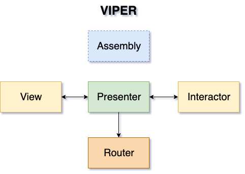
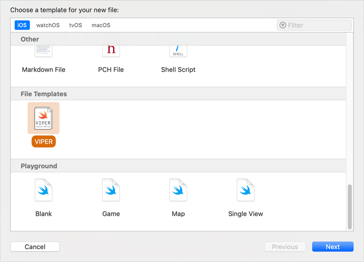
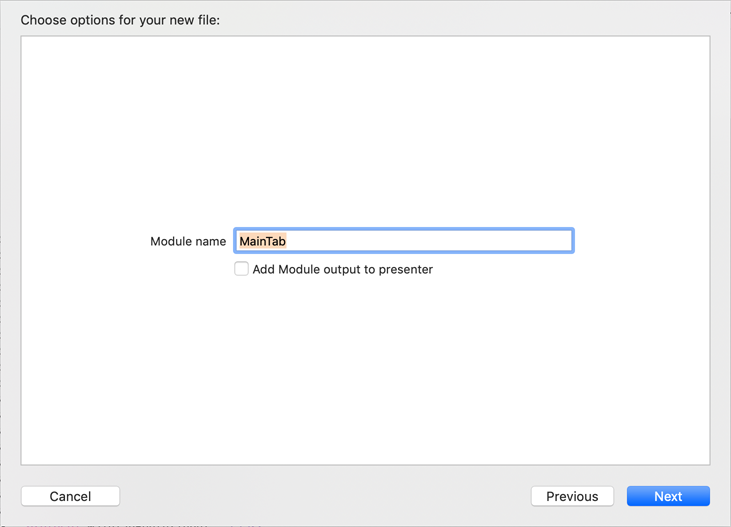
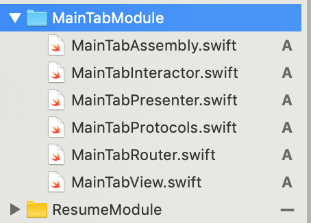
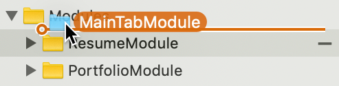
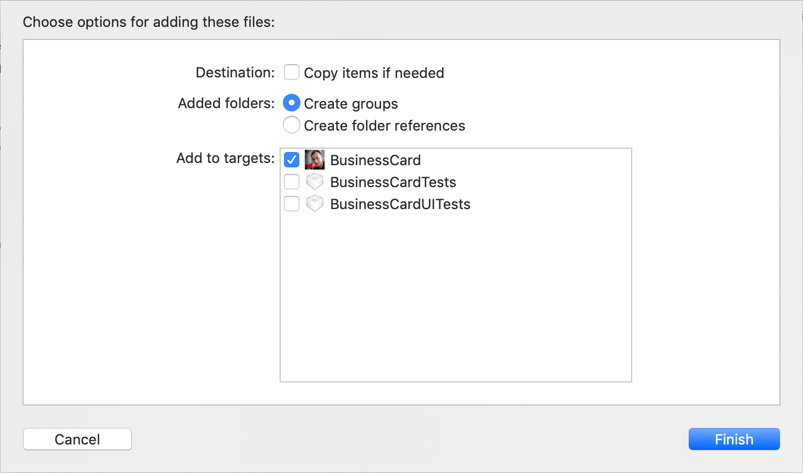

# VIPER Module

This is the module described by **Uncle Bob's Clear Architecture**. The concept is to divide application into different layers of the application in order to follow Single Responsibility Principle (SRP) of SOLID set of principles.

The template contains *Assembly* which configures whole module. The module consists of Presenter, View, Interactor and Router with approptiate relations



There are separate files for each class, however, all the protocols are collected in one file.

```
protocol MainTabModuleInput : class
{

}

protocol MainTabInteractorInput : class
{

}

protocol MainTabInteractorOutput : class
{

}

protocol MainTabViewInput : class
{
func setupInitialState()
}

protocol MainTabViewOutput : class
{
func didTriggerViewReadyEvent()
}

protocol MainTabRouterInput : class
{

}
```

**IMPORTANT:** The template uses the code placed in [ViperBase folder](../../ViperBase/) of this repo.**

## Installation

To install the template you just need to run *install* shell script from this directory
```
cd {this_directory_on_your_computer}
sh install.sh
```
and Voila, the template is ready for using! 

## Using

The precess of creating VIPER module is just process of creating new file, as simple as you create a class for your project



During creating module process you will face one option named *Add Module output to presenter*. Checking it you will add `moduleOutput` variable to presenter class instance:



## The only additional action

I've put the package of files into folder for comfort. Unfortunately xcode adds such structure as *folder references* but not as *group*.



The only action you need to do after ceating the module is re-add it to project navigator with *Create groups* option.




